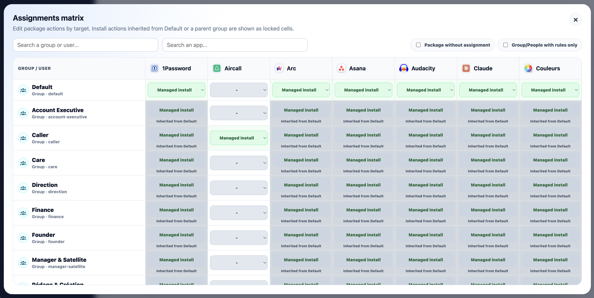
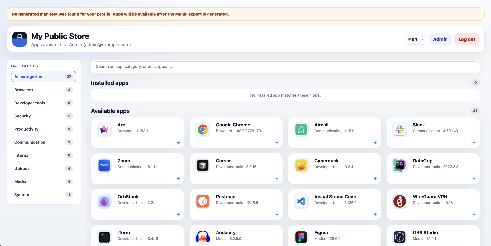

# Munkitop

Munkitop is a small web console for building and publishing a Munki repository without editing plist files by hand. It manages people, groups, packages and assignments, then exports a static Munki repo that clients can consume directly.

<p align="center">
  
  
</p>

<p align="center">
  
  
</p>

## Highlights

- Manage people with Munki `ClientIdentifier` values based on email.
- Organize people into groups that become Munki manifests.
- Import local `.pkg` or `.dmg` files, or reference remote package URLs.
- Track package metadata such as Munki name, display name, bundle identifier, version, SHA-256 hash and `.icns` icon.
- Assign packages to people or groups as install or uninstall actions.
- Bulk select and delete people, groups, packages and assignments with confirmation.
- Generate Munki `catalogs`, `manifests`, `pkgsinfo`, `pkgs` and `icons`.
- Preview, download and share `.mobileconfig` profiles for people and groups.
- Configure the external Munki repository URL from the app.
- Switch the UI between English and French, with browser language detection.


## Tech Stack

- Laravel 13
- React 19
- Inertia.js
- Vite
- styled-components
- SQLite
- Docker and Docker Compose

## Local Development

Start the development stack:

```bash
docker compose up --build
```

The app will be available at:

```text
http://localhost:8000
```

Default local credentials from `.env`:

```text
admin@example.com
password
```

## Munki Workflow

1. Add people and groups.
2. Add packages with a local `.pkg` or `.dmg` upload, or a remote package URL.
3. Assign packages to people or groups.
4. Open the Export view and generate the Munki repo.
5. Point Munki clients to the effective repository URL shown in the app.
6. Use the generated `.mobileconfig` profile for each person or group when needed, or create a share link for end users.

The exported repo is written to `MUNKI_REPO_PATH`, which defaults to:

```text
storage/app/munki_repo
```

In Docker development, the repository is stored in the `munki_repo` volume and exposed through static public links such as:

```text
http://localhost:8000/repo
http://localhost:8000/catalogs/production
http://localhost:8000/catalogs/all
http://localhost:8000/manifests/base
```

## Configuration

Important environment variables:

| Variable | Description | Default |
| --- | --- | --- |
| `APP_DISPLAY_NAME` | Name displayed in the sidebar and login screen | `Munkitop` |
| `APP_URL` | Base application URL used to build repository URLs | `http://localhost:8000` |
| `MUNKI_REPO_PATH` | Local path where the Munki repo is exported | `storage/app/munki_repo` |
| `MUNKI_DEFAULT_CATALOG` | Default catalog name | `production` |
| `MUNKI_BASE_MANIFEST` | Base manifest name | `base` |

The external client-facing URL can also be overridden from the Export page.

## Package Helper

`pkg.sh` is a small macOS helper for turning an app already installed in `/Applications` into a Munki-ready `.pkg`.

```bash
./pkg.sh "Application Name"
```

It expects `/Applications/Application Name.app`, creates `Application Name.pkg`, prints the SHA-256 hash, bundle identifier and version, then copies the app icon next to the package as `Application Name.icns`.

## License

Munkitop is released under the Apache License 2.0. See `LICENSE.md`.
